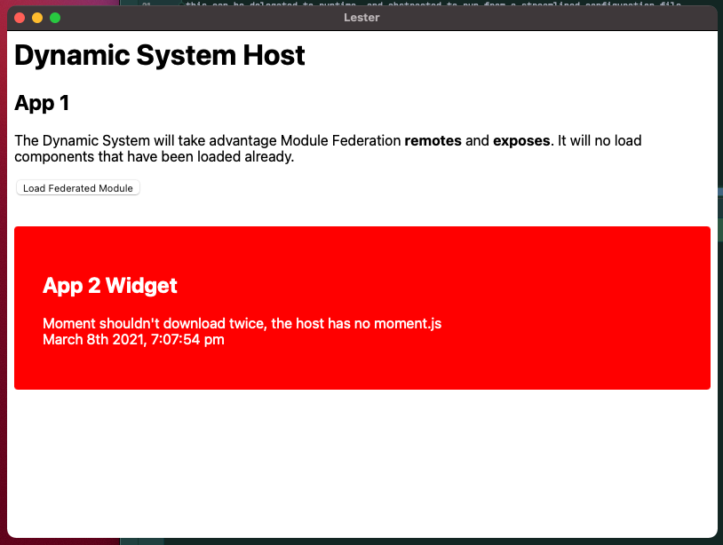

# What is Webpack?

[Webpack](https://webpack.js.org) is a web-tech bundler that will compile your application
into a set of distributable, static assets which can be run by just about any server. 

## What is Webpack Module Federation

Webpack Module Federation (WMF) was born out of the idea that multiple builds should be easily 
composable into a single application.  These builds should not have dependencies on each
other, and ostensibly, should be able to operate as standalone components.

At a high level, you have a set of builds, each of which acts as a container by which it
can be consumed by other federated modules.

For more information on Webpack Module Federation, check out their [docs](https://webpack.js.org/concepts/module-federation)

## How will this help Lester?

Crucially, WMF supports what is known as _dynamic remote containers_, meaning that you don't 
need to explicitly specify the containers you wish to pull from at build time.  Rather,
this can be delegated to runtime, and abstracted to run from a streamlined configuration file.

## Ok show me

Currently, this branch has a working demo.  If you pull the branch, and run

1. `yarn install`
2. `yarn tauri build --debug`

You should be able to run the application bundled by Tauri at the path specified in your console.
This demo will spawn a Webview using Tauri, and run a bare-bone root application.  Once loaded, you
will have the option to load a federated module, which is currently being hosted in an S3 bucket.

Assuming all goes well you should see something like this 

## Gotchas, todos, etc.

So, the big concession that was made in this demo is hosting the federated module on S3.  I am either too big a scrub
with any or all of Tauri, Rust, React, and Webpack, and getting it running such that the remote module could exist on
the local machine, and be pulled in to the running distributable was a nut that I could not crack.  That isn't to say
it cannot be done, but I banged my head sufficiently against a wall that I am willing to punt it down the line and let
others take a stab at it.